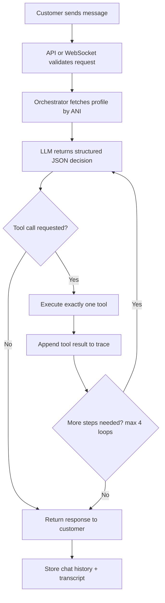
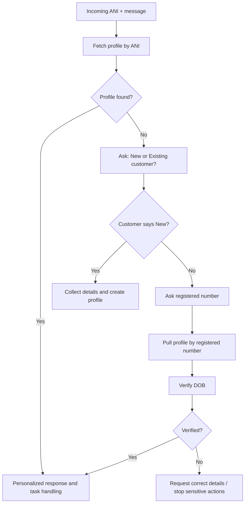
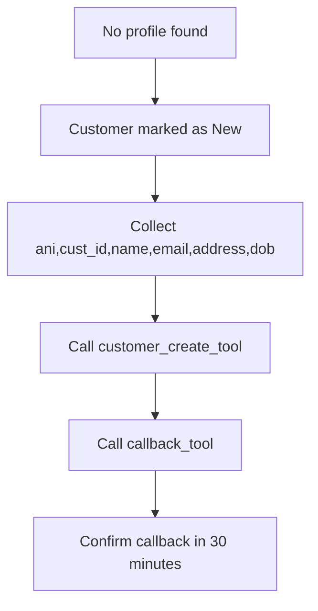
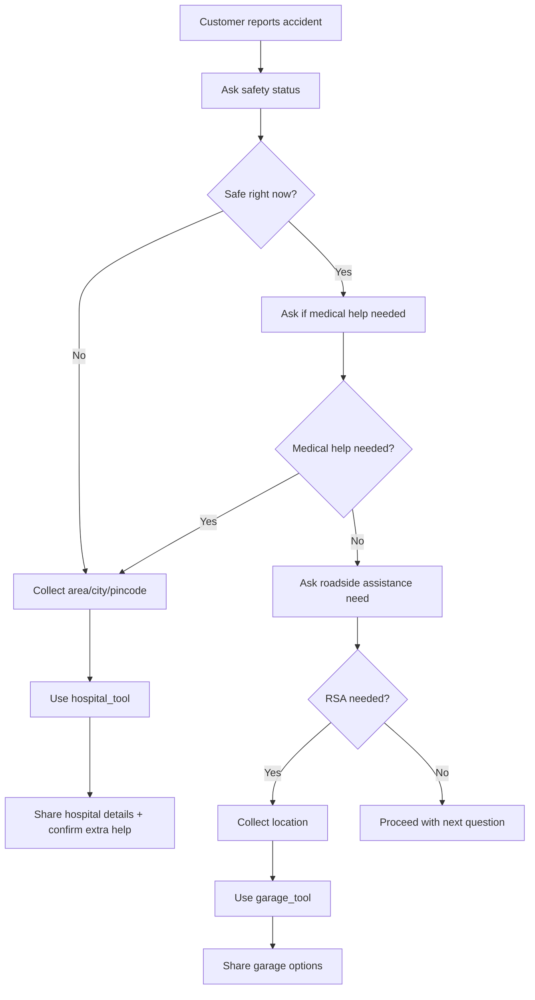
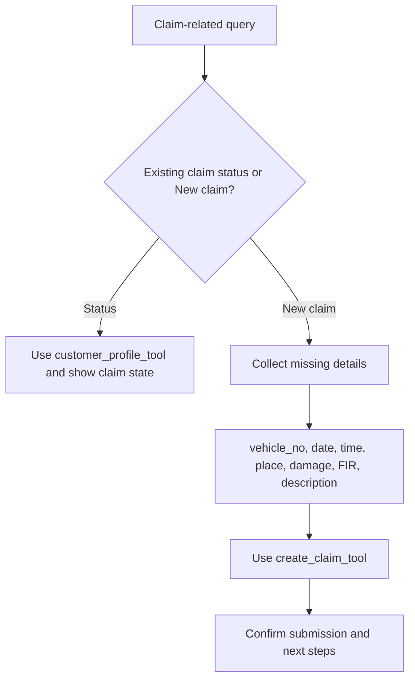
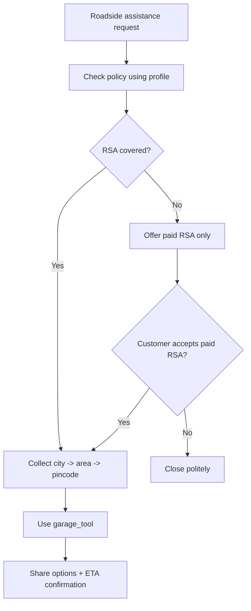
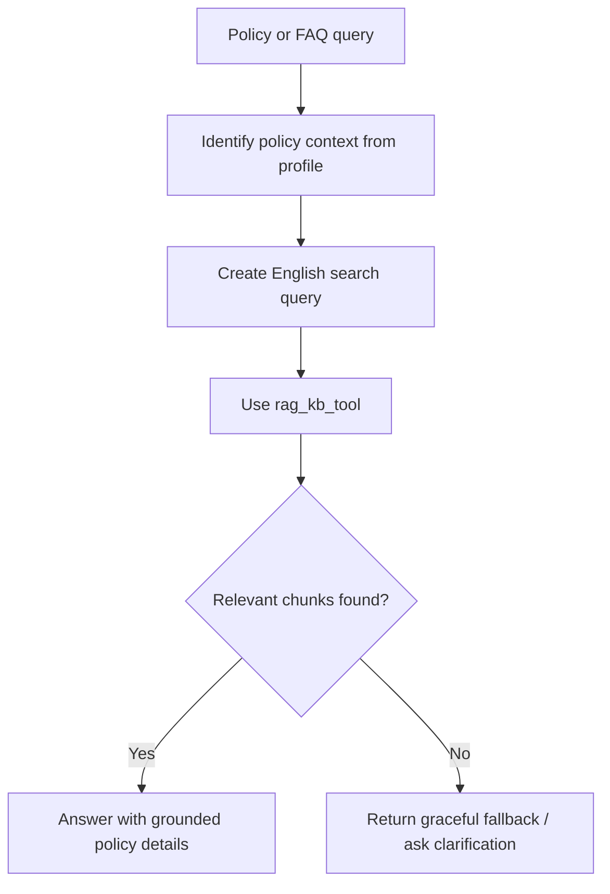
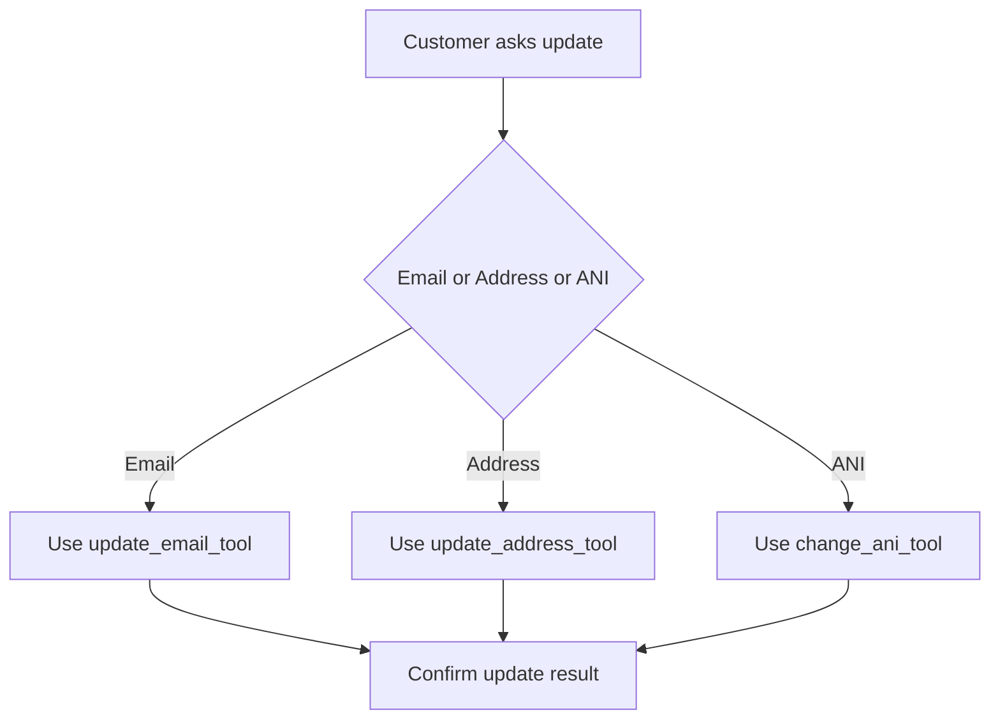
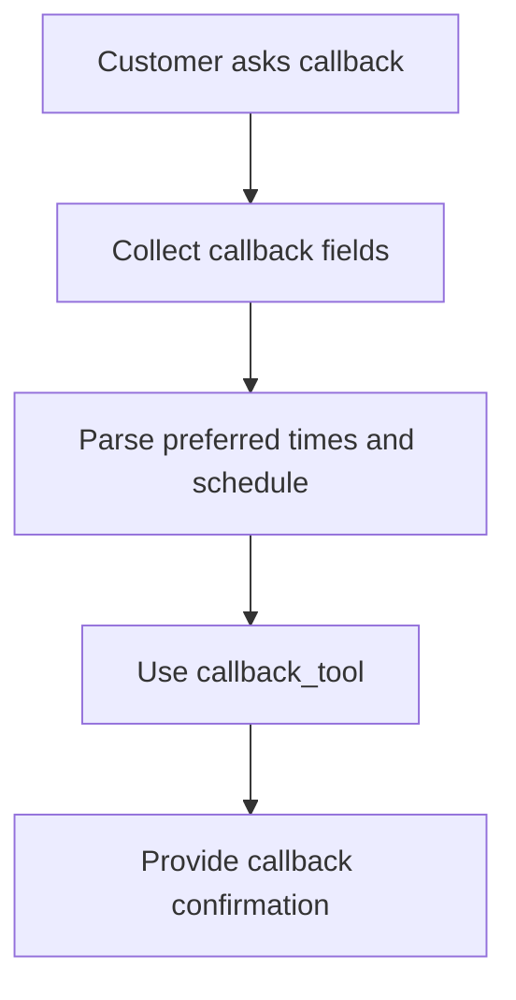
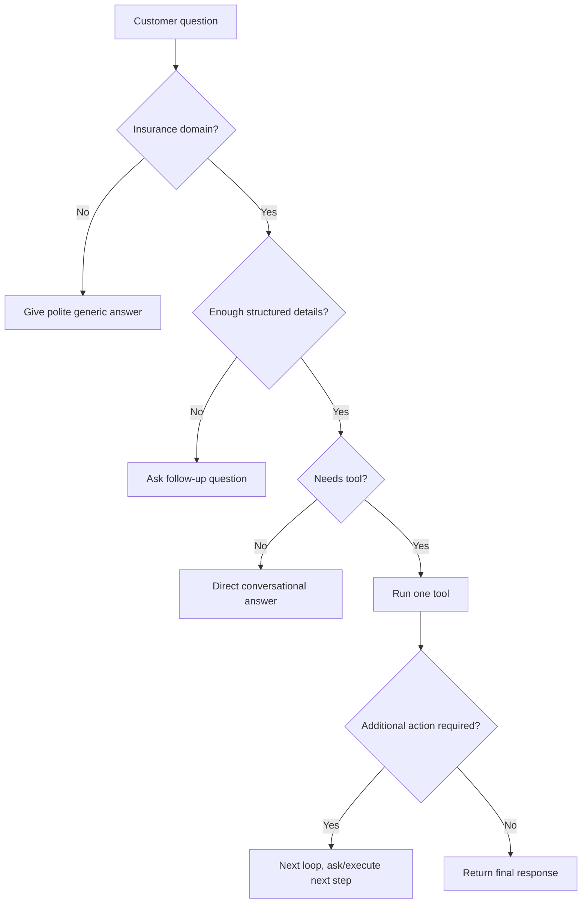

# Customer SOP - Insurence Bot v1.0

## 1. Purpose
This document explains how the customer-facing insurance assistant works, which flows it supports, how each flow is executed, and when complex or twisted questions can or cannot be handled reliably.

## 2. Scope
- Channel: REST (`POST /api/v1/chat`) and WebSocket (`/ws/chat`)
- Persona: "Priya from MokSa Insurance"
- Primary use cases include customer profile lookup/onboarding, accident help, claims, RSA, policy FAQ (RAG), account updates, and callback registration.

## 3. End-to-End Runtime Flow


## 4. Tool Map
<table>
  <thead>
    <tr>
      <th>Tool name</th>
      <th>Backend source</th>
      <th>Purpose</th>
    </tr>
  </thead>
  <tbody>
    <tr>
      <td><code>customer_create_tool</code></td>
      <td>PostgreSQL function <code>customer_create</code></td>
      <td>Create new customer profile</td>
    </tr>
    <tr>
      <td><code>customer_profile_tool</code></td>
      <td>PostgreSQL function <code>get_customer_profile_by_ani</code></td>
      <td>Pull profile by ANI</td>
    </tr>
    <tr>
      <td><code>pull_registered_profile_tool</code></td>
      <td>PostgreSQL function <code>get_customer_profile_by_ani</code></td>
      <td>Pull profile with user-provided phone</td>
    </tr>
    <tr>
      <td><code>update_email_tool</code></td>
      <td>PostgreSQL function <code>update_customer_email_by_ani</code></td>
      <td>Update email</td>
    </tr>
    <tr>
      <td><code>update_address_tool</code></td>
      <td>PostgreSQL function <code>update_customer_address_by_ani</code></td>
      <td>Update address</td>
    </tr>
    <tr>
      <td><code>change_ani_tool</code></td>
      <td>PostgreSQL function <code>change_customer_ani</code></td>
      <td>Change ANI</td>
    </tr>
    <tr>
      <td><code>create_claim_tool</code></td>
      <td>PostgreSQL function <code>create_claim_by_ani</code></td>
      <td>Submit new claim</td>
    </tr>
    <tr>
      <td><code>callback_tool</code></td>
      <td>PostgreSQL function <code>callback_create</code></td>
      <td>Create callback ticket</td>
    </tr>
    <tr>
      <td><code>hospital_tool</code></td>
      <td><code>data/excel/hospitals.xlsx</code></td>
      <td>Nearby hospital lookup</td>
    </tr>
    <tr>
      <td><code>garage_tool</code></td>
      <td><code>data/excel/garages.xlsx</code></td>
      <td>Nearby garage lookup</td>
    </tr>
    <tr>
      <td><code>rag_kb_tool</code></td>
      <td>PDF FAISS index (<code>data/pdfs</code>, <code>data/vector</code>)</td>
      <td>Policy/general FAQ answers</td>
    </tr>
  </tbody>
</table>

## 5. Core Customer Flows

### 5.1 Entry and Identity Flow


#### Example Conversation
```text
Customer: Hi, I need my policy details.
Priya: Hello Ramesh, Priya from MokSa Insurance here. Let me quickly check your profile.
Priya: Thanks for waiting, Ramesh. I found your profile. Your active policy is comprehensive and valid till 2027-03-31.
Customer: My ANI changed, I cannot access with old number.
Priya: I can help. Please share your registered phone and date of birth for verification.
Customer: DOB is 1994-10-14.
Priya: Verified. I can now continue with profile-linked requests.
```

### 5.2 New Customer Onboarding + Callback


#### Example Conversation
```text
Customer: I am new. I want to buy insurance.
Priya: Welcome. Priya from MokSa Insurance here. I will register your details and arrange a callback.
Priya: Please share your name.
Customer: Anjali Verma.
Priya: Please share your email.
Customer: anjali.v@example.com
Priya: Please share your address and date of birth.
Customer: Banjara Hills, Hyderabad. DOB 1997-05-20.
Priya: Done. Your callback is registered. Our team will call you within 30 minutes.
```

### 5.3 Accident Assistance Flow


#### Example Conversation
```text
Customer: I had an accident. I am not safe and need help now.
Priya: I am sorry this happened. Priya from MokSa Insurance here. Please share your area first.
Customer: Kukatpally.
Priya: Please share city.
Customer: Hyderabad.
Priya: Please share pincode.
Customer: 500072.
Priya: I found nearby hospitals and shared their contact details. Do you also want help with police or ambulance coordination?
```

### 5.4 Claim Assistance Flow


#### Example Conversation
```text
Customer: I want to file a new claim for yesterday's accident.
Priya: Sure. Priya from MokSa Insurance here. I will capture the required details and submit your claim.
Priya: I have your vehicle TS09AB1234. Please confirm incident date and time.
Customer: 2026-02-17, around 08:30 PM.
Priya: Please share location and damage description.
Customer: Near Hitech City signal, front bumper cracked.
Priya: Was FIR filed?
Customer: Yes, FIR1234.
Priya: Claim submitted successfully. I have shared your claim reference and next processing steps.
```

### 5.5 RSA Flow


#### Example Conversation
```text
Customer: My car broke down. Need roadside help.
Priya: Priya from MokSa Insurance here. I will check your RSA eligibility first.
Priya: Your policy has RSA coverage. Please share city.
Customer: Hyderabad.
Priya: Please share area.
Customer: Madhapur.
Priya: Please share pincode.
Customer: 500081.
Priya: I found nearby garages and can arrange assistance now. Estimated wait time is 35 to 45 minutes. Shall I confirm?
```

### 5.6 Policy and General FAQ Flow (RAG)


#### Example Conversation
```text
Customer: Is engine protection covered in my policy?
Priya: Priya from MokSa Insurance here. Let me check policy terms.
Priya: Engine protection is covered for internal damage caused by water ingression, subject to policy terms. I can also explain claim documentation required.
```

### 5.7 Profile Update Flow


#### Example Conversation
```text
Customer: Please update my email to ramesh.new@example.com.
Priya: Priya from MokSa Insurance here. I will update your registered email now.
Priya: Done. Your email has been updated successfully.
```

### 5.8 Callback Flow


#### Example Conversation
```text
Customer: Call me tomorrow morning for policy renewal.
Priya: Priya from MokSa Insurance here. I can schedule that. Preferred time window?
Customer: 9am to 11am.
Priya: Callback is registered. Our team will contact you in your preferred window.
```

## 6. Twisted/Complex Question Handling
A "twisted" question means multi-intent, ambiguous, mixed-language, or indirect phrasing (for example: "I had an accident yesterday, maybe file claim, maybe send garage, and by the way update my email").

### 6.1 Decision Logic


#### Example Conversation (Twisted Query)
```text
Customer: I had an accident, update my email, and also tell claim status.
Priya: Priya from MokSa Insurance here. First, are you safe right now?
Customer: Yes.
Priya: Do you need medical or roadside assistance immediately?
Customer: No, just claim and email update.
Priya: I found your profile and active claim record. Please share the new email to update first.
Customer: ramesh.claims@example.com
Priya: Email updated. Your latest claim is under assessment and currently in progress.
```

### 6.2 What It Handles Well
- Mixed language conversation; tool arguments are normalized in English.
- Indirect intent phrasing if it can be mapped to supported tools.
- Step-by-step clarification when required data is missing.
- Follow-up-only responses where a question is needed before action.

### 6.3 Practical Limits (Important)
- Only supported tools are executable. Unknown tool names are dropped.
- Tool execution is one tool per loop, with a hard stop after 4 loops.
- If schema validation fails repeatedly, fallback response is used (`I am here to help.`).
- If Excel/PDF data is missing, assistance and RAG responses degrade gracefully.
- Hospital search usually needs at least two matching fields among area/city/pincode when two or more are provided.

## 7. Operational SOP (Support/Operations Team)

### 7.1 Startup Checklist
1. Run DB bootstrap and verify required functions.
2. Ensure Excel files exist at `data/excel/hospitals.xlsx` and `data/excel/garages.xlsx`.
3. Ensure PDF files exist in `data/pdfs` for FAQ coverage.
4. Confirm health endpoint: `GET /health`
5. Confirm tool self-test: `GET /admin/tools/self-test`

### 7.2 Live Run Checklist
1. Use `POST /api/v1/chat` or `/ws/chat` for customer sessions.
2. Track `intent`, `follow_up_needed`, and `data_references` in responses.
3. Monitor `logs/app.log` for tool errors.
4. Review transcripts at `logs/transcripts/<ani>/<session>.json` for audits.

### 7.3 Incident / Escalation Triggers
Escalate to human agent if:
1. Identity verification fails repeatedly.
2. Accident case indicates unsafe situation and location is unavailable.
3. Customer asks unsupported actions outside defined tools.
4. Repeated fallback responses occur in the same session.
5. Callback creation or claim creation fails.

## 8. Example API Request/Response

### Request
```json
{
  "ani": "9000000001",
  "session_uuid": "optional",
  "input_message": "I had an accident and need help",
  "channel": "web"
}
```

### Response
```json
{
  "session_uuid": "generated-or-provided",
  "language": "en",
  "response": "Priya response text...",
  "follow_up_needed": true,
  "follow_up_query": "Are you safe right now?",
  "intent": "accident_emergency",
  "data_references": {
    "database_function": "get_customer_profile_by_ani",
    "external_source": null
  }
}
```

## 9. Quick Validation Scenarios
1. New customer with accident intent should create profile + callback before closure.
2. Existing customer with wrong ANI should route to registered phone + DOB verification.
3. Accident unsafe path should prioritize hospital lookup first.
4. Twisted multi-intent query should be broken into follow-up steps, not a single unsafe bulk action.
5. If tool errors occur, customer should still receive a safe fallback response.

## 10. Document Versions
- Markdown SOP: `docs/README.md`
- Word SOP: `docs/Customer_SOP_updated.docx`
